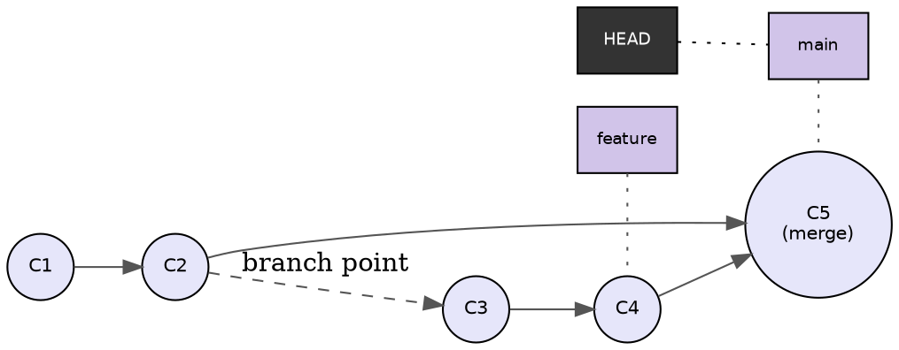

```dot
digraph GitBranching {
    rankdir=LR;
    node [shape=circle, style=filled, fillcolor="#e6e6fa", fontname="Helvetica", fontsize=10];
    edge [color="#555555"];

    // Main branch commits
    C1 [label="C1"];
    C2 [label="C2"];
    C5 [label="C5\n(merge)"];

    // Feature branch commits
    C3 [label="C3"];
    C4 [label="C4"];

    // Commit history edges (parent -> child)
    C1 -> C2;
    C2 -> C3 [style=dashed, label="branch point"];
    C3 -> C4;
    C2 -> C5;
    C4 -> C5;

    // Branch pointer labels
    node [shape=box, style=filled, fillcolor="#d1c4e9", fontsize=9];
    main [label="main"];
    feature [label="feature"];
    HEAD [label="HEAD", fillcolor="#333333", fontcolor="white"];

    main -> C5 [style=dotted, arrowhead=none];
    feature -> C4 [style=dotted, arrowhead=none];
    HEAD -> main [style=dotted, arrowhead=none, color="#000000"];

    { rank=same; C5; main; }
    { rank=same; C4; feature; }
}
```